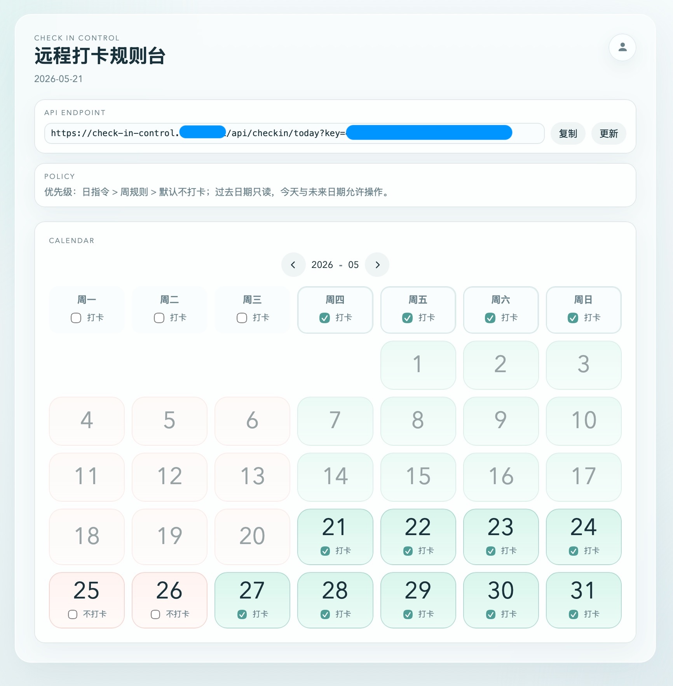
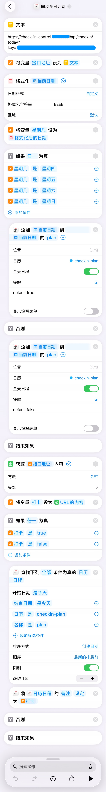
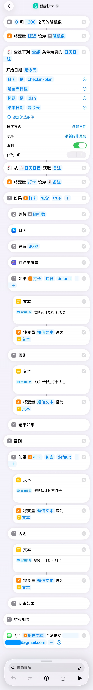
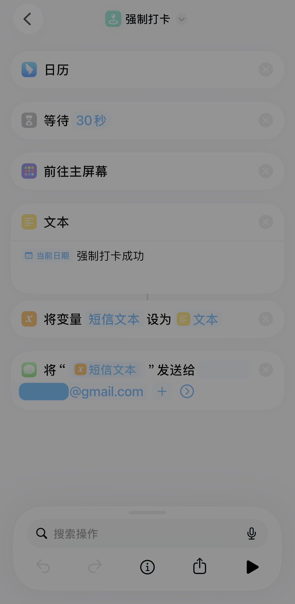
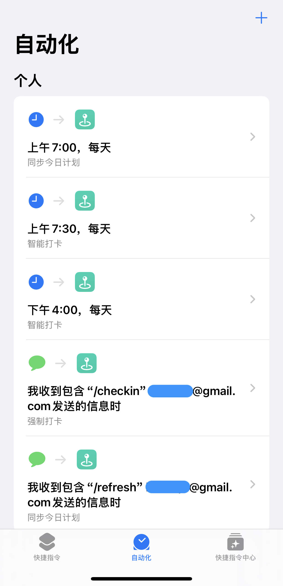

# Check In Control

一套用于远程钉钉自动打卡的完整解决方案。
自从钉钉版本升级后，iOS 下使用虚拟定位工具打卡时会触发钉钉的虚拟定位打卡识别。
因此最朴素的方案就是找一台老旧的 iPhone 手机插上电放在打卡地，多端登录钉钉，并且采用一定的技术手段触发每日自动打卡

核心思路：

- Web 端维护打卡规则
- iPhone 端快捷指令每日一早通过 Web 端的 API 读取当天打卡规则
- 网络失败时，iPhone 端仍可生成当日兜底规则
- 快捷指令按规则实现打卡，并通过 iMessage 信息通知打卡成功
- 可通过 iMessage 向打卡手机发送指令，通过快捷指令触发来实现：刷新当日打卡规则和强制打卡两种功能

## Web 端规则模型

系统只处理一件事：**今天最终是否打卡**。

判定优先级：

1. 日规则
2. 周规则
3. 默认不打卡

举例：

- 周四默认打卡，如果当天没有日规则，结果就是打卡
- 周四默认打卡，如果当天日规则强制不打卡，结果就是不打卡
- 周一默认不打卡，如果当天日规则强制打卡，结果就是打卡

所有日期和星期判断固定使用 `Asia/Shanghai`，避免服务器时区和手机时区不一致导致误判。

## Web 端当前功能

- 单管理员账号
- 首次默认密码登录后强制修改密码
- 周规则管理
- 日历视图管理未来日期
- 日规则覆盖周规则
- 生成带随机 `api_key` 的接口地址供快捷指令调用
- `/api/checkin/today` 返回纯文本 `true` / `false`
- 页面支持响应式布局，桌面和手机共用一套界面结构

截图：



## Web 端技术栈

- `Next.js` App Router
- `Postgres`（推荐 `Supabase`）
- `Vercel`
- 原生 `crypto.scrypt` 做密码散列
- HMAC Cookie Session


## Web 端部署

推荐部署方式：

- 代码托管到 GitHub
- 应用部署到 Vercel
- 数据库使用 Supabase Postgres

### 1. 准备代码仓库

先确认项目代码已经推送到 GitHub，并且后续会以 Git Push 的方式触发 Vercel 自动部署。

### 2. 创建 Supabase 数据库

1. 打开 [Supabase](https://supabase.com/) 并登录
2. 创建一个新的 Project
3. 填写项目名称
4. 设置数据库密码
5. 选择部署区域
6. 等待项目初始化完成

建议把以下信息单独保存好：

- Supabase 项目地址
- 数据库密码
- 后面要用到的数据库连接串

### 3. 获取数据库连接串

1. 进入刚创建的 Supabase 项目
2. 打开 `Connect` 或数据库连接设置页面
3. 找到 Postgres 连接串
4. 复制完整连接串，后面填入 `DATABASE_URL`

如果 Supabase 提供多种连接方式，优先选择适合部署环境使用的连接串。

### 4. 在 Vercel 导入仓库

1. 打开 [Vercel](https://vercel.com/) 并登录
2. 点击 `Add New` -> `Project`
3. 选择当前 GitHub 仓库并导入
4. 框架选择 `Next.js`
5. `Root Directory` 保持仓库根目录
6. 其他构建选项通常保持默认即可

### 5. 配置环境变量

在 Vercel 项目的 `Settings` -> `Environment Variables` 中添加以下变量：

#### `DATABASE_URL`

Supabase 的 Postgres 连接串。

#### `DATABASE_SSL`

填入：

```txt
enable
```

#### `DEFAULT_ADMIN_PASSWORD`

首次登录后台时使用的默认密码。  
这个密码只用于第一次登录，登录成功后系统会强制要求修改。

#### `SESSION_SECRET`

用于签名登录会话的随机字符串，建议至少 32 位。

例如可以在本地生成：

```bash
openssl rand -base64 32
```

#### `NEXT_PUBLIC_APP_URL`

站点最终访问地址，例如：

```txt
https://check-in-control.simo.cool
```

如果还没有绑定自定义域名，也可以先填写默认的 Vercel 域名：

```txt
https://your-project.vercel.app
```

### 6. 首次部署

环境变量配置完成后，在 Vercel 触发首次部署。部署成功后，访问首页或 `/login` 即可。

### 7. 数据库自动初始化

应用第一次连接数据库时，会自动初始化所需内容，不需要手工执行 migration。

首次运行会自动创建或写入：

- 单管理员账号
- 固定时区 `Asia/Shanghai`
- 随机 `api_key`
- 默认周规则：周四到周日打卡

### 8. 首次登录后台

1. 打开：

```txt
https://你的域名/login
```

2. 使用 `DEFAULT_ADMIN_PASSWORD` 登录
3. 登录后系统会强制要求修改密码
4. 修改完成后才能正常进入控制台

### 9. 绑定自定义域名

如果后续在 Vercel 中绑定了自己的域名：

1. 进入 `Settings` -> `Domains`
2. 添加自定义域名
3. 按 Vercel 提示在 DNS 服务商处添加解析记录
4. 等待域名生效
5. 把 `NEXT_PUBLIC_APP_URL` 更新为新的正式域名
6. 重新部署一次

否则后台中展示给快捷指令使用的 API 地址，仍然会保留旧的 `vercel.app` 域名。

### 10. 部署完成后的检查项

建议至少检查以下内容：

- 登录页可以正常打开
- 使用默认密码可以登录
- 首次登录后会强制修改密码
- 控制台页面可以正常显示月历和周规则
- 修改周规则或日规则后能立即生效
- 后台中展示的 API 地址与当前正式域名一致

接口检查方式：

```txt
https://你的域名/api/checkin/today?key=你的_api_key
```

成功时应返回：

```txt
true
```

或：

```txt
false
```

### 11. 后续更新代码

后续只需要把本地代码提交并推送到 GitHub，Vercel 就会自动重新部署。


## 快捷指令接口

接口地址：

```txt
GET /api/checkin/today?key=<api_key>
```

成功时返回纯文本：

```txt
true
```

或：

```txt
false
```

未授权时返回：

```json
{ "error": "unauthorized" }
```

对 iOS 快捷指令来说，纯文本 `true` / `false` 比 JSON 更容易判断。

## iPhone 快捷指令方案

因为快捷指令的功能限制，无法很好处理因网络故障导致的获取失败，当前推荐的是“双快捷指令 + 自动化”方案。另外需要关闭手机的自动锁屏，实现常亮。

### 1. 同步今日计划

用途：

- 每日最早定时执行
- 把默认的兜底规则缓存到手机日历，以防 Web API调用失败
- 调用 Web API，读取今天最终是否打卡
- 把结果更新到手机日历，供后续真正执行打卡的快捷指令使用

截图：



### 2. 智能打卡

用途：

- 每日早晚两次执行（签到/签退）
- 读取日历中是否打卡的设置
- 如果结果为 `true`，继续执行钉钉打卡
- 如果结果为 `false`，直接结束
- 并将打卡结果通过 iMessage 反馈给用户
- 通过随机延时实现一定时间范围内打卡，模拟真人操作

截图：



### 3. 手动刷新与强制打卡

用途：

- 作为人工兜底入口

截图：



### 4. 自动化

用途：

- 在固定时间自动执行刷新当日打卡规则
- 早上和傍晚分别跑一次智能打卡
- 用户通过 iMessage 发送 /refresh 可实现手动刷新当日打卡规则
- 用户通过 iMessage 发送 /checkin 可实现强制打卡

截图：


